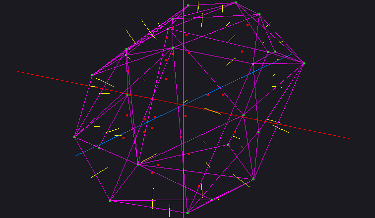
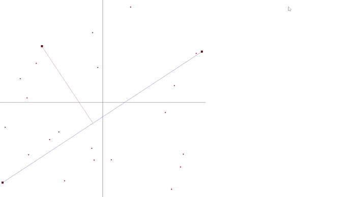
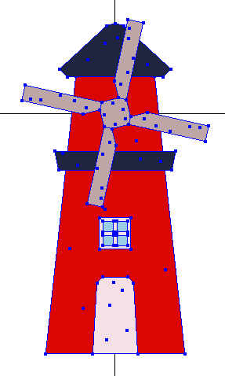
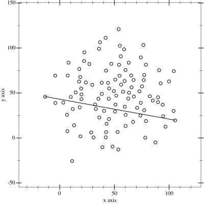
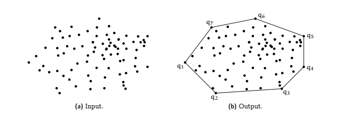

# Convex Hull Visualizer

> Visualização interativa do algoritmo de **Fecho Convexo** em 2D e 3D usando OpenGL.



---

## Índice

- [Sobre o Projeto](#sobre-o-projeto)
- [Demonstração](#demonstração)
- [Funcionalidades](#funcionalidades)
- [Estrutura do Projeto](#estrutura-do-projeto)
- [Pré-requisitos](#pré-requisitos)
- [Instalação e Build](#instalação-e-build)
- [Executáveis](#executáveis)
- [Como Usar](#como-usar)
- [Algoritmo](#algoritmo)
- [Tecnologias](#tecnologias)
- [Licença](#licença)

---

## Sobre o Projeto

Este projeto implementa e visualiza o algoritmo de **Fecho Convexo (Convex Hull) utilizando o QuickHull** para conjuntos de pontos em 2D e 3D. Desenvolvido como trabalho acadêmico, o programa gera pontos aleatórios e calcula o menor polígono convexo que os envolve, renderizando o resultado em tempo real com OpenGL.

---

## Demonstração

### Visualização 2D


### Visualização 3D


### Tema Visual


---

## Funcionalidades

- Geração de pontos aleatórios configurável
- Cálculo do fecho convexo em **2D** e **3D**
- Renderização em tempo real com **OpenGL**
- Múltiplos modos de visualização (padrão, tema, view)
- Saída do índice dos pontos que compõem o fecho no terminal
- Saída em OBJ exportável para outros softwares como **Blender**

---

## Estrutura do Projeto

```
Convex_hull/
├── main.cpp              # Executável principal (2D)
├── main3d.cpp            # Executável 3D
├── viewConvexHull.cpp    # Visualizador do fecho convexo
├── theme.cpp             # Visualização com tema (2D)
├── theme3d.cpp           # Visualização com tema (3D)
├── CMakeLists.txt        # Configuração do build
├── utils/
│   ├── convexHull.h      # Interface do algoritmo
│   ├── convexHull.cpp    # Implementação do algoritmo
│   ├── utils.h           # Utilitários (geração de pontos, render)
│   └── utils.cpp
├── external/
│   ├── glad/             # Loader de extensões OpenGL
│   │   ├── include/
│   │   └── src/
│   └── glfw/             # Janela e contexto OpenGL
│       ├── include/
│       └── lib-mingw-w64/
└── assets/               # Recursos visuais
```

---

## Pré-requisitos

- **CMake** >= 4.2
- **MinGW-w64** (GCC para Windows) ou equivalente
- **C++20** ou superior
- OpenGL suportado pela GPU (quase universal)

> As dependências **GLFW** e **GLAD** já estão incluídas na pasta `external/`, não é necessário instalá-las separadamente.

---

## Instalação e Build

### 1. Clone o repositório

```bash
git clone https://github.com/IMayanLP/Convex_hull.git
cd Convex_hull
```

### 2. Crie o diretório de build e compile

```bash
mkdir build
cd build
cmake .. -G "MinGW Makefiles"
cmake --build .
```

> **Atenção:** O projeto está configurado para `lib-mingw-w64`. Se estiver usando outro compilador/linker, ajuste o caminho em `CMakeLists.txt`.

---

## Executáveis

O projeto gera cinco executáveis independentes:

| Executável       | Descrição                                          |
|------------------|----------------------------------------------------|
| `main`           | Visualização padrão do fecho convexo em **2D**     |
| `main3d`         | Visualização do fecho convexo em **3D**            |
| `viewConvexHull` | Modo de visualização alternativo                   |
| `theme`          | Visualização 2D com tema visual customizado        |
| `theme3d`        | Visualização 3D com tema visual customizado        |

---

## Como Usar

Após compilar, rode o executável desejado dentro do diretório `build/`:

```bash
# Visualização 2D padrão
./main

# Visualização 3D
./main3d

# Modo tema 2D
./theme

# Modo tema 3D
./theme3d

# Visualizador de fecho
./viewConvexHull
```

A janela OpenGL abrirá com a renderização. Os índices dos pontos do fecho convexo serão impressos no terminal.

### Exemplo de saída no terminal

```
Fecho Convexo: 42 7 183 561 899 12 ...
```

---

## Algoritmo

O fecho convexo é calculado a partir de **1000 pontos gerados aleatoriamente** dentro de um espaço normalizado (`SCREEN_MIN` a `SCREEN_MAX`).

O algoritmo identifica o subconjunto mínimo de pontos cujo polígono convexo envolve todos os demais — equivalente a "esticar um elástico ao redor dos pontos".

### QuickHull

A técnica implementada nesse projeto foi o **QuickHull**, um algoritmo que utiliza do paradigma de **dividir para conquistar**, que consiste basicamente na ideia de encontrar o ponto mais distante de uma reta, formar um triângulo e descartar todos os seus pontos internos.

O algoritmo segue os seguintes passos:

1. Encontra dois pontos que estão no fecho (utilizados os de `minX` e `maxX`);
2. Divide todos os pontos restantes em dois conjuntos: **C1** e **C2**, sendo os pontos à esquerda de `min→max` e à direita de `min→max`, respectivamente;
3. Recursivamente, para cada conjunto, encontra o ponto mais distante da reta, forma um triângulo, descartando todos os seus pontos internos, calcula novos conjuntos C1 e C2 e aplica a recursão;
4. Analogamente para os pontos no conjunto da direita;
5. Ao final do algoritmo, obtém-se um polígono convexo que engloba todos os pontos.



Fonte: https://en.wikipedia.org/wiki/Quickhull

### Detalhes de Implementação

**Como calcular a primeira reta:**
Dado um dos eixos (X ou Y — utilizado o X), verifica-se para todos os pontos quais têm a coordenada máxima e mínima nesse eixo.

**Como saber se um ponto está à esquerda ou à direita da reta AB:**
Dados os pontos `A`, `B` e `P`, e os vetores `AB` e `AP`, calcula-se o **produto vetorial** entre `AB` e `AP`:
- Produto vetorial **> 0** → ponto à esquerda
- Produto vetorial **< 0** → ponto à direita

**Como encontrar o ponto mais distante da reta AB:**
O ponto `P` mais distante da reta `AB` é aquele que forma o maior triângulo `ABP`, calculado pela **área orientada** usando produto vetorial.

**Como a recursão é aplicada:**
Após encontrar o triângulo `ABP`, a recursão é aplicada para dois novos conjuntos — não mais esquerda/direita de `AB`, mas:
- Pontos à **esquerda de AP**
- Pontos à **esquerda de PB**

(as duas novas arestas do triângulo formado). Pontos internos ao triângulo são descartados.


Fonte: https://medium.com/@harshitsikchi/convex-hulls-explained-baab662c4e94

### Complexidade

| Caso      | Complexidade |
|-----------|--------------|
| Médio     | O(n log n)   |
| Pior Caso | O(n²)        |

---

## Tecnologias

- **C++20**
- **OpenGL** — renderização gráfica
- **GLFW** — criação de janela e contexto
- **GLAD** — carregamento de extensões OpenGL
- **CMake** — sistema de build

---

## Licença

Distribuído sob a licença MIT. Veja [`LICENSE`](LICENSE) para mais informações.
